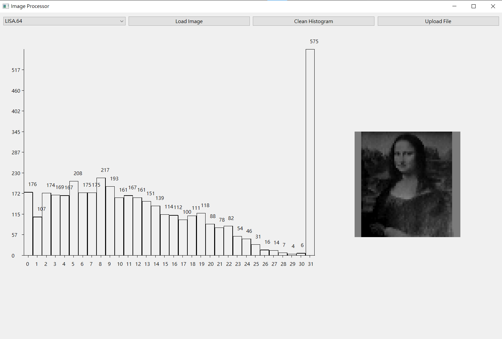
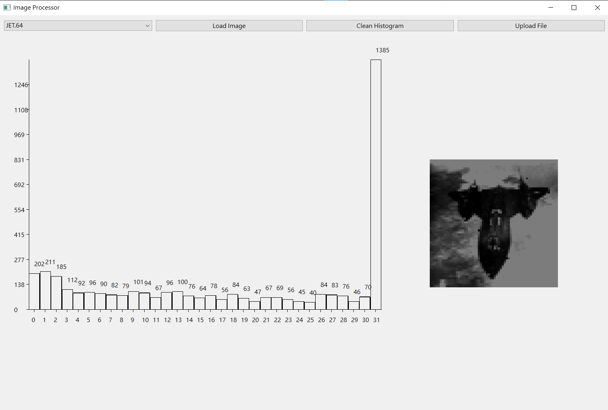
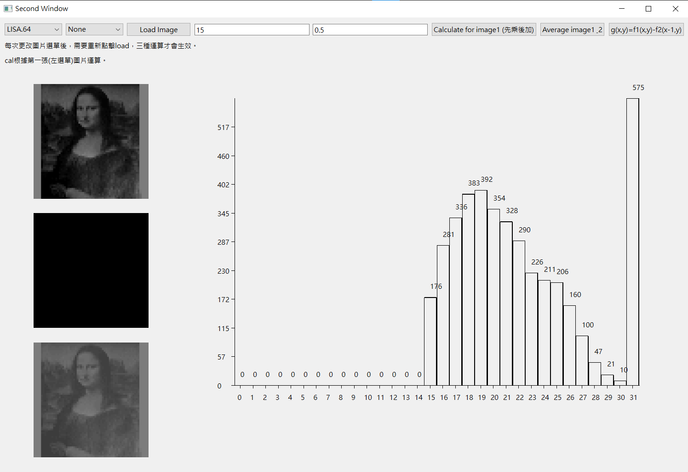

# Part 1. Histogram of an Image
Design a software program to read the special .64 image file described in our lecture.  
Translate the .64 text file into a 64x64 image with 32 gray levels and store the data in a 2-dimensional array.  
Process the image array to obtain the histogram of the image.  
Test your program with the following .64 files and plot the histogram of each image. LISA.64, LINCOLN.64, JET.64, LIBERTY.64.  
You may plot the image histogram directly in your software program or plot the histogram with any plotting software such as EXCEL or MATLAB.  
Designing a function in your program to display the image on the screen is encouraged.
<br/>

## 【解釋算法】
以paintevent實作 計算、繪製、直方圖:

```c++
void ImageProcessor::generateHistogram()
{
    // 確認直方圖是淨空的
    std::fill(histogram.begin(), histogram.end(), 0);
    int count = 0;
    // 計算每個灰階強度的出現次數
    for (const auto &row : imageArray)
    {
        for (const int value : row)
        {
            histogram[value]++;
            count++;
        }
    }

    printf("total count = %d\n", count);
    int sum = 0;
    for (int i = 0; i < 32; i++)
    {
        qDebug() << "value: " << i << ", count: " << histogram[i];
        sum += histogram[i];
    }
    printf("sum = %d\n", sum);
}

void ImageProcessor::paintEvent(QPaintEvent *event) // 繪製事件 使用update()函數時自動觸發
{
    QPainter painter(this);

    // 繪製直方圖
    drawHistogram(painter);
}

void ImageProcessor::drawHistogram(QPainter &painter)
{
    int barWidth = 22;     // 條形寬度
    int xOffset = 50;      // x 軸起始位置
    int yOffset = 550;     // y 軸起始位置
    int maxHeight = 500;   // 最大高度
    int labelInterval = 5; // 標籤間隔，交錯顯示

    // 計算最大數值
    int maxCount = *std::max_element(histogram.begin(), histogram.end());

    // 繪製 x 軸
    painter.drawLine(xOffset, yOffset, xOffset + 32 * barWidth, yOffset);

    // 繪製 y 軸
    painter.drawLine(xOffset, yOffset, xOffset, yOffset - maxHeight);

    // 繪製直方圖條形
    for (int i = 0; i < 32; i++) // 只顯示到 32
    {
        int barHeight = static_cast<int>((static_cast<double>(histogram[i]) / maxCount) * maxHeight);
        int x = xOffset + i * barWidth;
        int y = yOffset - barHeight;

        painter.drawRect(x, y, barWidth - 1, barHeight);

        // 繪製條形的數值
        painter.drawText(x + (barWidth - 1) / 2, y - 15, QString::number(histogram[i]));

        // 繪製 x 軸刻度
        if (i % labelInterval == 0)
        {
            // 繪製 x 軸標籤
            painter.drawText(x + (barWidth - 1) / 2 - 5, yOffset + 25, QString::number(i));
            // 繪製 x 軸外刻度
            painter.drawLine(x + (barWidth - 1) / 2, yOffset, x + (barWidth - 1) / 2, yOffset + 5);
        }
    }

    // 繪製 y 軸刻度 共有numTicks個刻度
    int numTicks = 10;
    int tickInterval = maxHeight / numTicks;

    for (int i = 0; i < numTicks; i++)
    {
        int y = yOffset - i * tickInterval;
        painter.drawLine(xOffset - 5, y, xOffset, y); // 繪製刻度線
        painter.drawText(xOffset - 30, y + 5, QString::number(static_cast<int>(i * maxCount / numTicks)));
    }
}
```

</br>
繪製灰階影像:

```c++
void ImageProcessor::displayGrayImage()
{
    // 創建QImage以儲存灰階影像
    QImage image(64, 64, QImage::Format_Grayscale8);

    for (int row = 0; row < 64; row++)
    {
        for (int col = 0; col < 64; col++)
        {
            int value = imageArray[row][col];                    // 從 imageArray 取得值
            image.setPixel(col, row, qRgb(value, value, value)); // 設置為灰階顏色
        }
    }

    // 將影像儲存到檔案
    image.save("gray_image.png");

    // 更新窗口以顯示影像
    QPixmap pixmap = QPixmap::fromImage(image);
    QLabel *imageLabel = new QLabel(this);
    imageLabel->setPixmap(pixmap.scaled(256, 256)); // 顯示 256x256 大小的影像
    imageLabel->setGeometry(850, 250, 256, 256);    // 設置影像位置(左上角x,y)和大小(w,h) 須符合圖片大小
    imageLabel->show();
}
```

## 【結果圖片】
|  |  |
| :-----------------------------------------------: | :------------------------------------------------: |
|               LISA.64直方圖與灰階圖               |                JET.64直方圖與灰階圖                |

|  |  |
| :----------------------------------------------------: | :--------------------------------------------------: |
|                LINCOLN.64直方圖與灰階圖                |                LIBERTY.64直方圖與灰階                |

## 【結果討論】
這次作業我使用Qt/C++，並且全程沒有使用圖形介面輔助。在一開始建置環境時遇到許多問題，包含如何將openCV導入到Qt當中、如何在vscode當中直接編譯執行而不需要Qt creator。接下來找學習資源的過程也是一波三折。我查詢到的資源似乎都是詳細的從頭教到尾，沒有快速建立一個簡單範本，讓我能夠快速應用在作業上的教學。因此從頭開始學習花費許多時間。最後只能簡單先看前面幾集，再邊查邊學。

# Part 2. Arithmetic Operations of an Image Array
Design a software program that will perform the basic tasks of arithmetic operations on an image or two images.    
Use the .64 image for this program.  
The assigned image processing operations are as follows:  
1. Add or subtract a constant value to each pixel in the image.
2. Multiply a constant to each pixel in the image.
3. Create a new image which is the average image of two input images.
4. Create a new image g(x,y) in which the value of each pixel is determined by calculating the pixel values of the input image f(x,y) using the following equation: 
   $$ g(x,y) = f1(x,y) - f2(x-1,y) $$
<!-- <br/> -->

## 【解釋算法】
線性運算:

```c++
void SecondProcess::p_calculateImage(int addend, double multiplier)
{
    // 計算影像的加法和乘法
    // 最後記得檢查數值會不會超過 255 或是小於 0
    for (int i = 0; i < imageArray1.size(); i++)
    {
        for (int j = 0; j < imageArray1[i].size(); j++)
        {
            // 先乘後加
            imageArrayAns[i][j] = static_cast<int>(std::round(imageArray1[i][j] * multiplier));
            imageArrayAns[i][j] = imageArrayAns[i][j] + addend;

            // 將結果限制在 [0, 255] 範圍內
            if (imageArrayAns[i][j] < 0)
                imageArrayAns[i][j] = 0;
            if (imageArrayAns[i][j] > 255)
                imageArrayAns[i][j] = 255;
        }
    }
    displayGrayImage();
    update(); // 強制重繪
}
```

</br>
平均兩圖:

```c++
void SecondProcess::p_averageImage()
{
    // 檢查一定要載入兩個影像
    if (image2Path == "None")
    {
        QMessageBox::critical(this, "Error", "Please load image2 first");
        return;
    }

    // 計算兩個影像的平均值
    // 這裡只是一個示例，實際上需要根據您的需求來實現
    for (int i = 0; i < imageArray1.size(); i++)
    {
        for (int j = 0; j < imageArray1[i].size(); j++)
        {
            imageArrayAns[i][j] = (imageArray1[i][j] + imageArray2[i][j]) / 2;
        }
    }

    displayGrayImage();
    update(); // 強制重繪
}
```

</br>
g(x,y) = f1(x,y) - f2(x-1,y):

```c++
void SecondProcess::p_gxImage()
{
    // 檢查一定要載入兩個影像
    if (image2Path == "None")
    {
        QMessageBox::critical(this, "Error", "Please load image2 first");
        return;
    }

    // 計算兩個影像的 g(x,y)=f1(x,y)-f2(x-1,y)
    for (int i = 0; i < imageArray1.size(); i++)
    {
        for (int j = 0; j < imageArray1[i].size(); j++)
        {
            if (i > 0) // 避免 i - 1 為負數
            {
                imageArrayAns[i][j] = imageArray1[i][j] - imageArray2[i - 1][j];
            }
            else
            {
                imageArrayAns[i][j] = imageArray1[i][j]; // i == 0 時，僅使用 imageArray1
            }

            // 將結果限制在 [0, 255] 範圍內
            if (imageArrayAns[i][j] < 0)
                imageArrayAns[i][j] = 0;
            if (imageArrayAns[i][j] > 255)
                imageArrayAns[i][j] = 255;
        }
    }

    displayGrayImage();
    update(); // 強制重繪
}
```

## 【結果圖片】

<p align="center">最下方圖為最上方圖*5+10後的結果</p>
</br>


<p align="center">最下方圖為兩圖平均的結果</p>
</br>


<p align="center">最下方圖為g(x,y) = f1(x,y) - f2(x-1,y)的結果</p>
</br>

## 【結果討論】
由於第一小題還在邊做邊學的過程，程式架構設計的不太好，擴充性不佳，不容易直接改成適應兩個輸入圖片的版面。因此第二個作業我把大部分的程式碼又重寫了一次，但感覺還是能做得更好，例如讓class的功能更細化，分出更多個widget方便版面編排等。

另外在讀取文件的時候發現一個問題，花費我許多時間才解決。即.64文件儲存的換行不是\n而是\r\n，導致每當文件讀到最後就會報錯(因為\r不是32進制字元)。

還有因為我的電腦中有許多gcc編譯器，因此導致無法直接使用winployqt.exe產生相應的dll檔，也不能直接從Qt資料夾中複製所需的dll檔。而是需要直接開啟對應版本的mingw，再執行winployqt才可以產生正確的動態函式庫。最後還需要至系統環境變數，將對應版本的gcc拉到最上面，才能正確執行檔案。