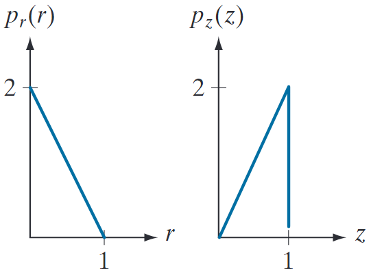
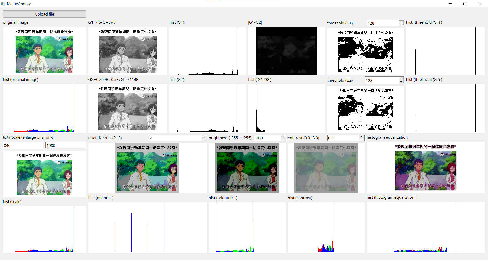

# Part 1. Histogram of an Image
Solve the problems 2.12, 2.16, 2.18, 2.37, 3.12, 3.18 in the textbook.  

### 【2.12】
**Q:** Suppose that a flat area with center at $(x_0, y_0)$ is illuminated by a light source with intensity distribution  
$$
i(x, y) = K e^{-[(x - x_0) + (y - y_0)]}
$$
Assume for simplicity that the reflectance of the area is constant and equal to 1.0, and let $K = 255$. If the intensity of the resulting image is quantized using k bits, and the eye can detect an abrupt change of eight intensity levels between adjacent pixels, what is the highest value of k that will cause visible false contouring?  

**A:** $0 \sim 255$ 相當於$2^8=256$，也就是說一個像素的灰階值可以用 8 bits 表示。此外題目敘述當鄰近像素強度變化達到 8 時眼睛才有辦法觀測。$log_{2}(256/8) = log_{2}(32) = 5$，因此當$k = 5$時就可以觀察到假輪廓。
 


### 【2.16】
**Q:** Develop an algorithm for converting a one-pixelthick m-path to a 4-path.  

**A:**   
4-path: 僅能上下左右移動(不可對角線)  
m-path: 可以上下左右+對角線移動  
```python
def convert_mpath_to_4path(m_path):
    # 初始化結果的 4-path
    four_path = []
    
    # 將起點添加到 4-path 中
    four_path.append(m_path[0])
    
    # 遍歷路徑中的每對相鄰點
    for i in range(1, len(m_path)):
        x_i, y_i = m_path[i - 1]
        x_next, y_next = m_path[i]
        
        # 如果是4-連通，直接添加到結果中
        if abs(x_next - x_i) + abs(y_next - y_i) == 1:
            four_path.append((x_next, y_next))
        else:
            # 處理對角連接，插入水平或垂直移動
            four_path.append((x_next, y_i))     # 先水平移動
            four_path.append((x_next, y_next))  # 後垂直移動
    
    return four_path

# 測試範例
m_path = [(1, 1), (2, 2), (3, 2), (4, 3)]
four_path = convert_mpath_to_4path(m_path)
print(four_path)
```


### 【2.18】
**Q:**  Consider the image segment shown in the figure that follows.  
**(a)** * As in Section 2.5, let $V = {0,1}$ be the set
of intensity values used to define adjacency. Compute the lengths of the shortest 4-, 8-, and m-path between $p$ and $q$ in the following image. If a particular path does not exist between these two points, explain why.

$$
\begin{bmatrix}
    & 3 & 1 & 2 & 1 & (q) \\
    & 2 & 2 & 0 & 2 & \\
    & 1 & 2 & 1 & 1 & \\
    (p) & 1 & 0 & 1 & 2 & \\
\end{bmatrix}
$$

**(b)** Repeat (a) but using $V = [1, 2]$.

**A:** 


### 【2.37】
**Q:** We know from Eq. (2-45) that an affine transformation of coordinates is given by  

$$
\begin{bmatrix}
    x' \\
    y' \\
    1 \\
\end{bmatrix}
=A
\begin{bmatrix}
  x \\
  y \\
  1 \\  
\end{bmatrix}
=
\begin{bmatrix}
    a_{11} & a_{12} & a_{13} \\
a_{21} & a_{22} & a_{23} \\
0 & 0 & 1
\end{bmatrix}
\begin{bmatrix}
  x \\
  y \\
  1 \\  
\end{bmatrix}
$$

where $(x',y')$ are the transformed coordinates, $(x,y)$ are the original coordinates, and the elements of $A$ are given in Table 2.3 for various types of transformations. The inverse transformation, $A^{−1}$ , to go from the transformed back to the original coordinates is just as important for performing inverse mappings.

**(a)** * Find the inverse scaling transformation.  
**(b)** Find the inverse translation transformation.  
**(c)** Find the inverse vertical and horizontal shearing transformations.  
**(d)** * Find the inverse rotation transformation.  
**(e)** * Show a composite inverse translation/rotation transformation.  

**A:** 


### 【3.12】
**Q:** An image with intensities in the range $[0,1]$ has the PDF, $p_r(r)$, shown in the following figure. It is desired to transform the intensity levels of this image so that they will have the specified $p_z(z)$ shown in the figure. Assume continuous quantities, and find the transformation (expressed in terms of $r$ and $z$) that will accomplish this.  
<p align="center">
    
</p>

**A:** 


### 【3.18】
**Q:** You are given the following kernel and image:
$$
w = 
\begin{bmatrix}
    1 & 2 & 1 \\
    2 & 4 & 2 \\
    1 & 2 & 1 \\
\end{bmatrix}
\quad \quad \quad \quad
f = 
\begin{bmatrix}
    0 & 0 & 0 & 0 & 0 \\
    0 & 0 & 1 & 0 & 0 \\
    0 & 0 & 1 & 0 & 0 \\
    0 & 0 & 1 & 0 & 0 \\
    0 & 0 & 0 & 0 & 0 \\
\end{bmatrix}
$$

**(a)** * Give a sketch of the area encircled by the large ellipse in Fig. 3.28 when the kernel is centered at point $(2,3)$ (2nd row, 3rd col) of the image shown above. Show specific values of $w$ and $f$.  
**(b)** * Compute the convolution $w$ ☆ $f$ using theminimum zero padding needed. Show the details of your computations when the kernel is centered on point $(2,3)$ of $f$; and then show the final full convolution result.  
**(c)** Repeat (b), but for correlation, $w$ ★ $f$ .

**A:** 


<br/>

# Part 2. Arithmetic Operations of an Image Array
Design a software program that can achieve the following image processing operations:  
1. Read a color BMP or JPEG image file and display it on the screen. You may use the functions provided by Qt, OpenCV, or MATLAB to read and display an image file. (10%)  
<br/>
2. Convert a color image into a grayscale image using the following equations:  
    $$
    \text{GRAY} = \frac{R + G + B}{3}
    $$
    $$
    \text{GRAY} = 0.299 \times R + 0.587 \times G + 0.114 \times B
    $$
    Compare the grayscale images obtained from the above equations. One way to compare the difference between two images is by image subtraction (5%)  
<br/>
3. Determine and display the histogram of a grayscale image. (10%)  
<br/>
5. Implement a manual threshold function to convert a grayscale image into a binary image. (10%)  
<br/>
6. Implement a function to adjust the spatial resolution (enlarge or shrink) and grayscale levels of an image. Use an interpolation method on enlarging an image. (10%)  
<br/>
7. Implement a function to adjust the brightness and contrast of an image. (10%)  
<br/>
8. Implement a histogram equalization function for automatic contrast adjustment. (15%)  
<br/>

Test your image processing functions with various images and compare the processed image with those processed with Photoshop, PhotoImpact, or other similar commercial image processing software.

Write a report to describe and discuss your image processing program. You are encouraged to design a graphical user-friendly interface for your program containing the designated functions.
<!-- <br/> -->

## 【解釋算法】
### 灰階
#### G1 = (R+G+B)/3
#### G2 = 0.299*R + 0.587*G + 0.114*B
#### diff(G1, G2)

### 二值化

### 縮放

### 量化

### 亮度調整

### 對比調整

### 直方圖均衡化

## 【結果圖片】
放圖片  




## 【結果討論】
### 灰階
#### G1 = (R+G+B)/3
#### G2 = 0.299*R + 0.587*G + 0.114*B
#### diff(G1, G2)

### 二值化

### 縮放

### 量化

### 亮度調整

### 對比調整

### 直方圖均衡化
