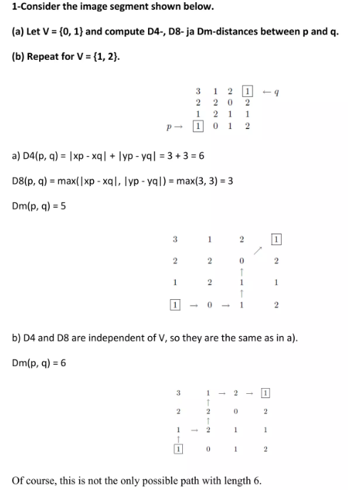

# Part 1. Histogram of an Image
Solve the problems 2.12, 2.16, 2.18, 2.37, 3.12, 3.18 in the textbook.  

### 【2.12】
**Q:** Suppose that a flat area with center at $(x_0, y_0) $ is illuminated by a light source with intensity distribution  
$$
i(x, y) = K e^{-[(x - x_0) + (y - y_0)]}
$$
Assume for simplicity that the reflectance of the area is constant and equal to 1.0, and letK = 255. If the intensity of the resulting image is quantized using k bits, and the eye can detect an abrupt change of eight intensity levels between adjacent pixels, what is the highest value of k that will cause visible false contouring?  

**A:** 
 

### 【2.16】
**Q:** Develop an algorithm for converting a one-pixelthick m-path to a 4-path.  

**A:** 

### 【2.18】
**Q:**  Consider the image segment shown in the figure
that follows.
**(a)** * As in Section 2.5, let V = { , 0 1} be the set
of intensity values used to define adjacency. Compute the lengths of the shortest 4-, 8-, and m-path between p and q in the following image. If a particular path does not exist between these two points, explain why.

$$
\begin{bmatrix}
    & 3 & 1 & 2 & 1 & (q) \\
    & 2 & 2 & 0 & 2 & \\
    & 1 & 2 & 1 & 1 & \\
    (p) & 1 & 0 & 1 & 2 & \\
\end{bmatrix}
$$

**(b)** Repeat (a) but using V = [1, 2].

**A:** 

### 【2.37】
**Q:** We know from Eq. (2-45) that an affine transformation of coordinates is given by  

$$
\begin{bmatrix}
x_1 & y_1 \\
x_2 & y_2 \\
x_3 & y_3 \\
\end{bmatrix}
=
\begin{bmatrix}
a_{11} & a_{12} & a_{13} \\
a_{21} & a_{22} & a_{23} \\
a_{31} & a_{32} & a_{33} \\
\end{bmatrix}
\begin{bmatrix}
1 \\
2 \\
3 \\
\end{bmatrix}
$$

**A:** 

### 【3.12】
**Q:** 

**A:** 

### 【3.18】
**Q:** 

**A:** 

 

## 【解釋算法】

## 【結果圖片】

## 【結果討論】

# Part 2. Arithmetic Operations of an Image Array
Design a software program that will perform the basic tasks of arithmetic operations on an image or two images.    
Use the .64 image for this program.  
The assigned image processing operations are as follows:  
1. Add or subtract a constant value to each pixel in the image.
2. Multiply a constant to each pixel in the image.
3. Create a new image which is the average image of two input images.
4. Create a new image g(x,y) in which the value of each pixel is determined by calculating the pixel values of the input image f(x,y) using the following equation: 
   $$ g(x,y) = f1(x,y) - f2(x-1,y) $$
<!--   -->

## 【解釋算法】
線性運算:

c++
void SecondProcess::p_calculateImage(int addend, double multiplier)
{
    // 計算影像的加法和乘法
    // 最後記得檢查數值會不會超過 255 或是小於 0
    for (int i = 0; i < imageArray1.size(); i++)
    {
        for (int j = 0; j < imageArray1[i].size(); j++)
        {
            // 先乘後加
            imageArrayAns[i][j] = static_cast<int>(std::round(imageArray1[i][j] * multiplier));
            imageArrayAns[i][j] = imageArrayAns[i][j] + addend;

            // 將結果限制在 [0, 255] 範圍內
            if (imageArrayAns[i][j] < 0)
                imageArrayAns[i][j] = 0;
            if (imageArrayAns[i][j] > 255)
                imageArrayAns[i][j] = 255;
        }
    }
}

 
平均兩圖:

c++
void SecondProcess::p_averageImage()
{
    // 檢查一定要載入兩個影像
    if (image2Path == "None")
    {
        QMessageBox::critical(this, "Error", "Please load image2 first");
        return;
    }

    // 計算兩個影像的平均值
    // 這裡只是一個示例，實際上需要根據您的需求來實現
    for (int i = 0; i < imageArray1.size(); i++)
    {
        for (int j = 0; j < imageArray1[i].size(); j++)
        {
            imageArrayAns[i][j] = (imageArray1[i][j] + imageArray2[i][j]) / 2;
        }
    }
}

 
g(x,y) = f1(x,y) - f2(x-1,y):

c++
void SecondProcess::p_gxImage()
{
    // 檢查一定要載入兩個影像
    if (image2Path == "None")
    {
        QMessageBox::critical(this, "Error", "Please load image2 first");
        return;
    }

    // 計算兩個影像的 g(x,y)=f1(x,y)-f2(x-1,y)
    for (int i = 0; i < imageArray1.size(); i++)
    {
        for (int j = 0; j < imageArray1[i].size(); j++)
        {
            if (i > 0) // 避免 i - 1 為負數
            {
                imageArrayAns[i][j] = imageArray1[i][j] - imageArray2[i - 1][j];
            }
            else
            {
                imageArrayAns[i][j] = imageArray1[i][j]; // i == 0 時，僅使用 imageArray1
            }

            // 將結果限制在 [0, 255] 範圍內
            if (imageArrayAns[i][j] < 0)
                imageArrayAns[i][j] = 0;
            if (imageArrayAns[i][j] > 255)
                imageArrayAns[i][j] = 255;
        }
    }
}

## 【結果圖片】

    

題目選單

 

#### 【線性運算】
|  |  |
| :------------------------------------: | :------------------------------------: |
|             LISA * 0.5 + 0             |            LISA * 0.5 + 16             |
|  |  |
|             JET * 1.2 + 0              |             LISA * 1.8 + 0             |

#### 【平均圖片】
|  |  |
| :------------------------------------: | :-------------------------------------: |
|           avg(LISA, LINCOLN)           |            avg(LIBERTY, JET)            |

#### 【$g(x,y)=f1(x,y)-f2(x-1,y)$】
|  |  |
| :-------------------------------------: | :-------------------------------------: |
|           g(LINCOLN, LINCOLN)           |            g(LIBERTY, LISA)             |

## 【結果討論】
1. 線性運算:   
   加法運算相當於調整影像亮度、乘法運算相當於調整影像對比度。  
2. 平均圖片:   
   平均圖片相當於將兩張所選圖片/2以後相加，因此可以看到兩張圖片被刷淡後的輪廓。  
3. f1(x,y)-f2(x-1,y):   
   因為兩張圖片僅差在x差了一格pixel，因此如果選擇同張圖片相減，顯示的圖片會近似於x方向邊緣檢測的效果。  
   如果選擇不同圖片的話，f2會產生有點像是負片的效果。  