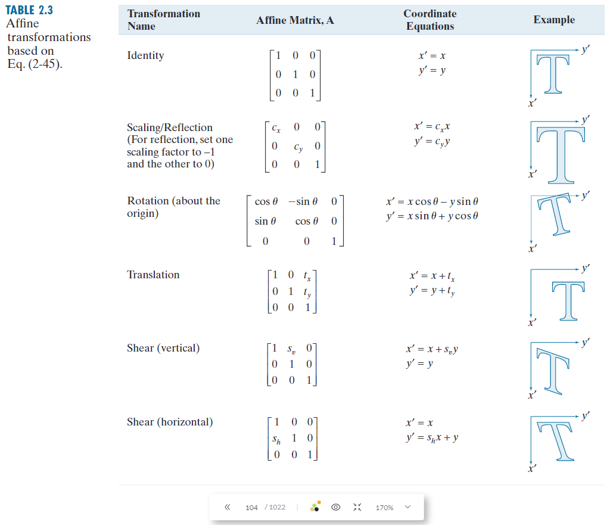

# Part 1. Histogram of an Image
Solve the problems 2.12, 2.16, 2.18, 2.37, 3.12, 3.18 in the textbook.  

### 【2.12】
**Q:** Suppose that a flat area with center at $(x_0, y_0)$ is illuminated by a light source with intensity distribution  
$$
i(x, y) = K e^{-[(x - x_0) + (y - y_0)]}
$$
Assume for simplicity that the reflectance of the area is constant and equal to 1.0, and let $K = 255$. If the intensity of the resulting image is quantized using k bits, and the eye can detect an abrupt change of eight intensity levels between adjacent pixels, what is the highest value of k that will cause visible false contouring?  

**A:** $0 \sim 255$ 相當於$2^8=256$，也就是說一個像素的灰階值可以用 8 bits 表示。此外題目敘述當鄰近像素強度變化達到 8 時眼睛才有辦法觀測。$log_{2}(256/8) = log_{2}(32) = 5$，因此當$k = 5$時就可以觀察到假輪廓。
 


### 【2.16】
**Q:** Develop an algorithm for converting a one-pixelthick m-path to a 4-path.  

**A:**   
4-path: 僅能上下左右移動(不可對角線)  
m-path: 可以上下左右+對角線移動  
```python
def convert_mpath_to_4path(m_path):
    four_path = []
    
    # 將起點添加到 4-path 中
    four_path.append(m_path[0])

    # 遍歷路徑中的每對相鄰點
    for i in range(1, len(m_path)):
        x_i, y_i = m_path[i - 1]
        x_next, y_next = m_path[i]
        
        # 如果是4-連通，直接添加到結果中
        if abs(x_next - x_i) + abs(y_next - y_i) == 1:
            four_path.append((x_next, y_next))
        else:
            # 處理對角連接，插入水平或垂直移動
            four_path.append((x_next, y_i))     # 先水平移動
            four_path.append((x_next, y_next))  # 後垂直移動
    
    return four_path
```
```python
# 測試範例
m_path = [(1, 1), (2, 2), (3, 2), (4, 3)]
four_path = convert_mpath_to_4path(m_path)
print(four_path)
```


### 【2.18】
**Q:**  Consider the image segment shown in the figure that follows.  
**(a)** * As in Section 2.5, let $V = \{0,1\}$ be the set
of intensity values used to define adjacency. Compute the lengths of the shortest 4-, 8-, and m-path between $p$ and $q$ in the following image. If a particular path does not exist between these two points, explain why.

$$
\begin{bmatrix}
    & 3 & 1 & 2 & 1 & (q) \\
    & 2 & 2 & 0 & 2 & \\
    & 1 & 2 & 1 & 1 & \\
    (p) & 1 & 0 & 1 & 2 & \\
\end{bmatrix}
$$

**A:**  
僅考慮存在於V集合當中的元素 (也就是元素!= 0 or 1的路徑不可走)  
最短 4 path adjacency: 不存在。因為 4 path 只能上下左右移動，然而終點q上下左右鄰近的元素皆不在 set $V$ 當中。  
最短 8 path adjacency: 不存在。因為從起點唯一的斜角元素不屬於 set $V$。  
最短 m path adjacency: p (4, 1) → (4, 2) → (3, 3) → (2, 3) → q (1, 4)  


**(b)** Repeat (a) but using $V = [1, 2]$.

**A:**  
僅考慮存在於V集合當中的元素 (也就是元素!= 1 or 2的路徑不可走)  
最短 4 path adjacency: p (4, 1) → (3, 1) → (2, 1) → (2, 2) → (1, 2) → (1, 3) → q (1, 4)  
最短 m path adjacency: p (4, 1) → (3, 2) → (2, 2) → (1, 2) → (1, 3) → q (1, 4)  

### 【2.37】
**Q:** We know from Eq. (2-45) that an affine transformation of coordinates is given by  

$$
\begin{bmatrix}
    x' \\
    y' \\
    1 \\
\end{bmatrix}
=A
\begin{bmatrix}
  x \\
  y \\
  1 \\  
\end{bmatrix}
=
\begin{bmatrix}
    a_{11} & a_{12} & a_{13} \\
a_{21} & a_{22} & a_{23} \\
0 & 0 & 1
\end{bmatrix}
\begin{bmatrix}
  x \\
  y \\
  1 \\  
\end{bmatrix}
$$
where $(x',y')$ are the transformed coordinates, $(x,y)$ are the original coordinates, and the elements of $A$ are given in Table 2.3 for various types of transformations. The inverse transformation, $A^{−1}$ , to go from the transformed back to the original coordinates is just as important for performing inverse mappings.
<p align="center">
    
</p>

**(a)** * Find the inverse scaling transformation.  
**A:** 縮放
$$
A = 
\begin{bmatrix}
    s_x & 0 & 0 \\
    0 & s_y & 0 \\
    0 & 0 & 1
\end{bmatrix}
\quad \quad \quad \quad
A^{-1} = 
\begin{bmatrix}
    \frac{1}{s_x} & 0 & 0 \\
    0 & \frac{1}{s_y} & 0 \\
    0 & 0 & 1
\end{bmatrix}
$$

**(b)** Find the inverse translation transformation.  
**A:** 平移

$$
A = 
\begin{bmatrix}
    1 & 0 & t_x \\
    0 & 1 & t_y \\
    0 & 0 & 1
\end{bmatrix}
\quad \quad \quad \quad
A^{-1} = 
\begin{bmatrix}
    1 & 0 & -t_x \\
    0 & 1 & -t_y \\
    0 & 0 & 1
\end{bmatrix}
$$

**(c)** Find the inverse vertical and horizontal shearing transformations.  
**A:** 垂直/水平剪切
$$
A = 
\begin{bmatrix}
    1 & h_x & 0 \\
    0 & 1 & 0 \\
    0 & 0 & 1
\end{bmatrix}
\quad \quad \quad \quad
A^{-1} = 
\begin{bmatrix}
    1 & -h_x & 0 \\
    0 & 1 & 0 \\
    0 & 0 & 1
\end{bmatrix}
$$
$$
A = 
\begin{bmatrix}
    1 & 0 & 0 \\
    h_y & 1 & 0 \\
    0 & 0 & 1
\end{bmatrix}
\quad \quad \quad \quad
A^{-1} = 
\begin{bmatrix}
    1 & 0 & 0 \\
    -h_y & 1 & 0 \\
    0 & 0 & 1
\end{bmatrix}
$$

**(d)** * Find the inverse rotation transformation.  
**A:** 旋轉 ($A$為逆時針, $A^{-1}$為順時針)
$$
A = 
\begin{bmatrix}
    \cos \theta & -\sin \theta & 0 \\
    \sin \theta & \cos \theta & 0 \\
    0 & 0 & 1
\end{bmatrix}
\quad \quad \quad \quad
A^{-1} = 
\begin{bmatrix}
    \cos \theta & \sin \theta & 0 \\
    -\sin \theta & \cos \theta & 0 \\
    0 & 0 & 1
\end{bmatrix}
$$


**(e)** * Show a composite inverse translation/rotation transformation.  
**A:** 旋轉+平移
$$
A = 
\begin{bmatrix}
    \cos \theta & -\sin \theta & t_x \\
    \sin \theta & \cos \theta & t_y \\
    0 & 0 & 1
\end{bmatrix}
\quad \quad \quad \quad
A^{-1} = 
\begin{bmatrix}
    \cos \theta & \sin \theta & -t_x \cos \theta - t_y \sin \theta \\
    -\sin \theta & \cos \theta & t_x \sin \theta - t_y \cos \theta \\
    0 & 0 & 1
\end{bmatrix}
$$


### 【3.12】
**Q:** An image with intensities in the range $[0,1]$ has the PDF, $p_r(r)$, shown in the following figure. It is desired to transform the intensity levels of this image so that they will have the specified $p_z(z)$ shown in the figure. Assume continuous quantities, and find the transformation (expressed in terms of $r$ and $z$) that will accomplish this.  
<p align="center">
    
</p>

**A:** 此題目要求做直方圖匹配 (histogram matching)
$$p_r(r) = -2r + 2 \quad\quad\quad\quad\quad\quad\quad\quad\quad\quad p_z(z) = 2z$$
$$s = T(r) = (L-1) \int_0^r p_r(w) \, dw = (2-1) \int_0^r (2-2w) = [2w-w^2]_0^r = 2r-r^2$$  
$$G(z) = (L-1) \int_0^z p_z(w) \, dw = (2-1) \int_0^r (2w) = [w^2]_0^z = z^2$$  
$$G^{-1}(z)=\sqrt{z}$$
$$Z=G^{-1}(s)=\sqrt{2r-r^2}$$

### 【3.18】
**Q:** You are given the following kernel and image:
$$
w = 
\begin{bmatrix}
    1 & 2 & 1 \\
    2 & 4 & 2 \\
    1 & 2 & 1 \\
\end{bmatrix}
\quad \quad \quad \quad
f = 
\begin{bmatrix}
    0 & 0 & 0 & 0 & 0 \\
    0 & 0 & 1 & 0 & 0 \\
    0 & 0 & 1 & 0 & 0 \\
    0 & 0 & 1 & 0 & 0 \\
    0 & 0 & 0 & 0 & 0 \\
\end{bmatrix}
$$

**(a)** * Give a sketch of the area encircled by the large ellipse in Fig. 3.28 when the kernel is centered at point $(2,3)$ (2nd row, 3rd col) of the image shown above. Show specific values of $w$ and $f$.  
**A:**  
當w固定在f(2,3)時，對應到的f為:
$$
f(2,3) = 
\begin{bmatrix}
    0 & 0 & 0 \\
    0 & 1 & 0 \\
    0 & 1 & 0 \\
\end{bmatrix}
$$
$$w = [1, 2, 1, 2, 4, 2, 1, 2, 1]$$
$$f(2,3)= [0, 0, 0, 0, 1, 0, 0, 1, 0]$$

**(b)** * Compute the convolution $w$ ☆ $f$ using theminimum zero padding needed. Show the details of your computations when the kernel is centered on point $(2,3)$ of $f$; and then show the final full convolution result.  
**A:**  
計算卷積時要把w反轉180，並且此題要求須要zero-padding。
$$w_{inv} = [1, 2, 1, 2, 4, 2, 1, 2, 1]$$
$$f(2,3)= [0, 0, 0, 0, 0, 0, 0, 0, 1, 0, 0, 1, 0, 0, 0, 0, 0]$$
$$ 
w ☆ f = [0, 0, 0, 0, 6, 0, 0, 6, 0] = 
\begin{bmatrix}
    0 & 0 & 0 \\
    0 & 6 & 0 \\
    0 & 6 & 0 \\
\end{bmatrix}
$$

**(c)** Repeat (b), but for correlation, $w$ ★ $f$ .  
**A:**  
計算correlation跟convolution的差別只在，correlation不用反轉w，而convolution需要。  
但因為**此題的w反轉前後相同，因此答案與 (b) 相同。**

<br/>

# Part 2. Arithmetic Operations of an Image Array
Design a software program that can achieve the following image processing operations:  
1. Read a color BMP or JPEG image file and display it on the screen. You may use the functions provided by Qt, OpenCV, or MATLAB to read and display an image file. (10%)  
2. Convert a color image into a grayscale image using the following equations:  
    $$
    \text{GRAY} = \frac{R + G + B}{3}
    $$
    $$
    \text{GRAY} = 0.299 \times R + 0.587 \times G + 0.114 \times B
    $$
    Compare the grayscale images obtained from the above equations. One way to compare the difference between two images is by image subtraction (5%)  
3. Determine and display the histogram of a grayscale image. (10%)  
4. Implement a manual threshold function to convert a grayscale image into a binary image. (10%)  
5. Implement a function to adjust the spatial resolution (enlarge or shrink) and grayscale levels of an image. Use an interpolation method on enlarging an image. (10%)  
6. Implement a function to adjust the brightness and contrast of an image. (10%)  
7. Implement a histogram equalization function for automatic contrast adjustment. (15%)  

Test your image processing functions with various images and compare the processed image with those processed with Photoshop, PhotoImpact, or other similar commercial image processing software.

Write a report to describe and discuss your image processing program. You are encouraged to design a graphical user-friendly interface for your program containing the designated functions.
<!-- <br/> -->

## 【算法實現與解釋】
### 灰階
#### G1 = (R+G+B)/3
```C++
// 計算灰階值 (平均)
int gray = static_cast<int>((red + green + blue) / 3);
```

#### G2 = 0.299*R + 0.587*G + 0.114*B
```C++
// 計算灰階值 (加權)
int gray = static_cast<int>(0.299 * red + 0.587 * green + 0.114 * blue);
```

#### diff(G1, G2)
```C++
// 計算差異
int diff = qAbs(gray1 - gray2);
```

### 二值化
```C++
// 二值化處理
gray = (gray > *threshold_rgb) ? 255 : 0;
```

### 縮放
#### 雙線性插值法
```C++
// 在原圖中對應的座標 (浮點數) 例如4x4矩陣中的(2,3)座標 相當於3x3原圖中的(1.5,2.25)座標
float oldX = x * xScale;
float oldY = y * yScale;

// 由oldXY 找到原圖中對應的四個相鄰像素
// 計算左上角像素座標 (x1, y1)
int x1 = static_cast<int>(std::floor(oldX)); // static_cast<int> 將資料型態轉為int
int y1 = static_cast<int>(std::floor(oldY)); // std::floor 取小於等於x的最大整數值
// 計算右下角像素座標 (x2, y2)
int x2 = std::min(x1 + 1, oldWidth - 1);  // 在 x1+1 和 oldWidth-1 之間取最小值 確保不超出原圖範圍
int y2 = std::min(y1 + 1, oldHeight - 1); // 因為圖片座標從0開始 所以要減1

// 計算相對位置
float xLerp = oldX - x1;
float yLerp = oldY - y1;

// 獲取這四個像素的強度
qGray p11 = image->pixel(x1, y1); // 左上
qGray p12 = image->pixel(x1, y2); // 左下
qGray p21 = image->pixel(x2, y1); // 右上
qGray p22 = image->pixel(x2, y2); // 右下

// 對灰階圖像進行雙線性插值
// 插值公式: f(x,y) = (1-x)(1-y)f(0,0) + x(1-y)f(1,0) + (1-x)yf(0,1) + xyf(1,1)
int gray = static_cast<int>((1 - xLerp) * ((1 - yLerp) * qGray(p11) + yLerp * qGray(p12)) + xLerp * ((1 - yLerp) * qGray(p21) + yLerp * qGray(p22)));
```

#### 最近鄰插值法
```C++
// 在原圖中對應的浮點座標
float oldX = x * xScale;
float oldY = y * yScale;

// 使用 std::round 來進行最近鄰計算
int nearestX = static_cast<int>(std::round(oldX));
int nearestY = static_cast<int>(std::round(oldY));

// 確保不越界
nearestX = std::min(std::max(nearestX, 0), oldWidth - 1);
nearestY = std::min(std::max(nearestY, 0), oldHeight - 1);

// 獲取最近鄰像素的顏色
QRgb pixel = image->pixel(nearestX, nearestY);
```

### 量化
```C++
// 量化處理 右移>> 相當於捨去低位數, 也就是量化本身。左移<< 相當於補0, 還原回0~255的範圍。
int Quantized = (gray >> (8 - *bits)) << (8 - *bits);
```

### 亮度調整
調整亮度相當於對影像強度做加法，也就是把直方圖左右偏移。
```C++
gray = qBound(0, gray + *brightness, 255);
```

### 對比調整
調整對比的實現是以影像強度的平均值為基準後做乘法，也就是使直方圖的分布更靠近兩個極端(乘數>1)或更集中於中間(乘數<1)。  
```C++
// 調整對比度 以128為中心 乘上對比度係數
gray = qBound(0.0, *contrast * (gray - 128) + 128, 255.0);
```

### 直方圖均衡化
定義新的影像強度: $s$, 舊的影像強度: $r$, 影像強度的最大值通常為255: $(L-1)$, 累積分佈函數: CDF(x). 轉換公式為: $s = (L-1)*CDF(r)$  
```C++
// 計算累積直方圖(CDF)
std::vector<int> cumulativeHistogram(256, 0);
cumulativeHistogram[0] = histogram[0];
for (int i = 1; i < 256; ++i){
        cumulativeHistogram[i] = cumulativeHistogram[i - 1] + histogram[i];}

// 計算均衡化後的灰階值
int totalPixels = width * height;
std::vector<int> equalizedGray(256, 0);
for (int i = 0; i < 256; ++i){
    equalizedGray[i] = static_cast<int>(255.0 * cumulativeHistogram[i] / totalPixels + 0.5);}
```

## 【結果圖片】
<p align="center">
    
    
    
</p>

## 【結果討論】
### 灰階
題目提供了兩個公式，用來將RGB彩色影像轉換為灰階影像。$G1 = (R+G+B)/3$, $G2 = 0.299*R + 0.587*G + 0.114*B$  
其中G1是直觀的平均法、G2是根據人眼對不同眼色的敏感度加權後的計算方式。  
可以觀察到G2的結果確實比G1的結果更加自然、立體有層次的感覺，並且直方圖也可以看出G2的灰階值整體會比G1更低一點點。而|G1-G2|的影像，因為灰階值差異不大，需要非常注意才能觀察到變化。

### 二值化
二值化相當於量化當中只使用1bit的特例，也就是只能表達0與1。但因為一般的圖片格式不直接支持這種格式的圖片，需要換個方式實現。也就是將大於閥值的灰階值設為255，小於閥值的灰階值設為0。  
如果粗暴的直接設128為閥值，出來的圖片結果其實不太好，會損失很多物件的輪廓。但如果在相對簡單的圖片當中，適當調整閥值，就可以分離出物件的輪廓。  

### 縮放
放大的部份，此程式僅展示雙線性插值法的結果，因為鄰近插值法放大的圖片相對來講會比較模糊。但是兩種方法都有程式實作，可以參考上面的【解釋算法】。  
而縮小時，可以觀察到當空間解析度降低，圖片會開始出現鋸齒、模糊甚至方塊的形狀。

### 量化
量化的目的是使用更少的位元數量，保存現有的資料，因此會使得色彩的解析度降低。  
一般的RGB範圍是從0~255，也就相當於一個色彩使用8個位元保存，如果想要使用3個位元保存，就相當於範圍32個強度為一個level，範圍變成0~7。

### 亮度調整
可以使得過曝或是曝光不足的影像更加清楚。

### 對比調整
高對比度的情況下，物體之間的區分變得更明顯，也會顯得更有立體感。低對比度的情況下，圖像變得較為平淡，物體之間的區分會變得模糊。  

### 直方圖均衡化
直方圖均衡化適用於圖片整體過亮或是過暗的情況，可以提升圖片的對比度和展現更多細節。但是用於本來亮度分佈就相對均勻的圖片時，可能反而會造成圖片看起來過於銳利或是不自然。  
實現概念為把原本影像強度比較集中的區間，映射到比較寬廣的區間；相對的原本影像強度比較離散的區間，映射到比較集中的區間。  

假設影像強度的範圍是連續而不是離散的(有無限多影像強度位元)的話，直方圖均衡化以後的直方圖，應該要是完全平坦的狀態，相當於每個影像強度分佈的機率都相同。  
但因為實際上影像的強度是用離散的方式保存，因此直方圖僅有稍微平緩，而非完全平坦的狀態。  
