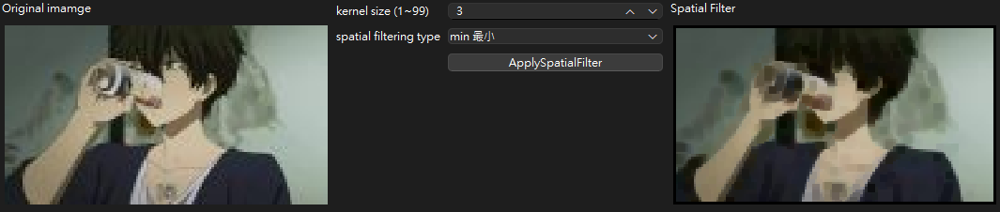
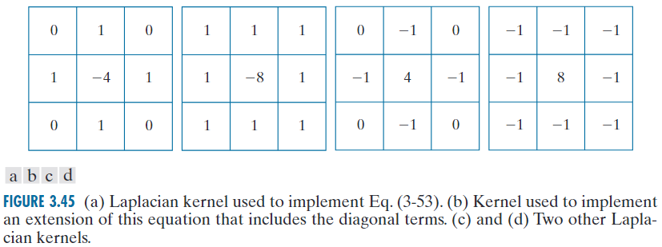
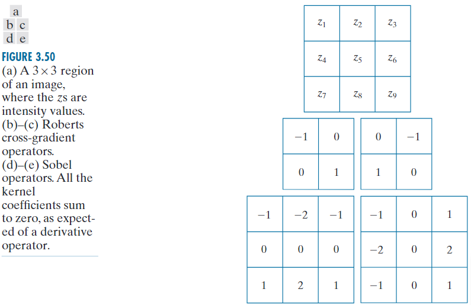
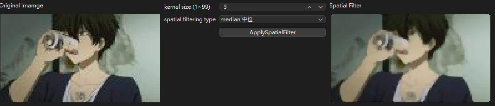
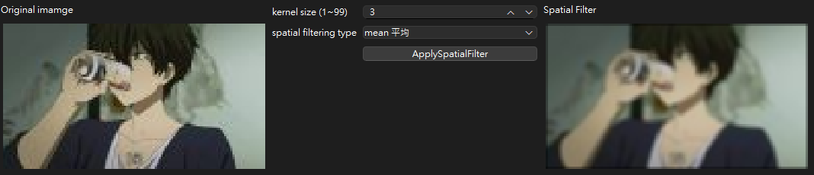

---
Header:
  Left: 影處HW3
  Right: R12631070 林育新
Footer:
  Center: 
---
<!-- 

    

 -->

# Part 1. 
Solve the problems 3.22, 3.28, 3.44, 4.3, 4.51 in the textbook.  

### 【3.22】
**Q:**  
**(a)**  If $v = [1\ 2\ 1]^T$ and $w^T = [2\ 1\ 1\ 3]$, is the kernel formed by $vw^T$ separable?  
**A:** 
$$
vw^T = \begin{bmatrix}
  1 \\
  2 \\
  1  
\end{bmatrix}
\begin{bmatrix}
  2 & 1 & 1 & 3
\end{bmatrix}
=
\begin{bmatrix}
  2 & 1 & 1 & 3 \\
  4 & 2 & 2 & 6 \\
  2 & 1 & 1 & 3 
\end{bmatrix}
$$  

**(b)**  The following kernel is separable. Find $w_1$ and $w_2$ such that $w = w_1 ★ w_2$ (convolution).  
$$
w = 
\begin{bmatrix}
    1 & 3 & 1 \\
    2 & 6 & 2
\end{bmatrix}
$$

**A:**  
$$
w_1 = 
\begin{bmatrix}
  1 \\
  2  
\end{bmatrix}

\quad\quad\quad\quad

w_2 = 
\begin{bmatrix}
  1 & 3 & 1
\end{bmatrix}
$$

$$

$$

### 【3.28】
**Q:** 
An image is filtered with three Gaussian lowpass kernels of sizes 3 x 3 , 5 x 5 , and 7 x 7 , and standard deviations 1.5, 2, and 4, respectively. A composite filter, w, is formed as the convolution of these three filters.  

**(a)** * Is the resulting filter Gaussian? Explain.  
**A:**  
結合多個高斯濾波器，結果也是高斯濾波器。  
原因在於兩個具有標準差的高斯函數的捲積$\sigma_1$ 和 $\sigma_2$ 結果是另一個高斯分佈，其組合標準差為$\sqrt{\sigma_1^2 + \sigma_2^2}$。  

**(b)** What is its standard deviation?  
**A:**  
$$
\sigma_{composite} = \sqrt{1.5^2 + 2^2 + 4^2} = \sqrt{22.25} \approx 4.71
$$

**(c)** What is its size? (感受野?不知道在問啥鬼)  
**A:**  
3 x 3 與 5 x 5 的kerenl卷積以後變成 ( 3 + 5 - 1 ) x ( 3 + 5 - 1 ) = 7 x 7的矩陣，  
再與 7 x 7 卷積以後變成 ( 7 + 7 - 1 ) x ( 7 + 7 - 1 ) = 13 x 13。
最終複合濾波器的大小是13 x 13
  

### 【3.44】
**Q:**  Are any of the following highpass (sharpening) kernels separable? For those that are, find vectorsv and $w$ such that $vw^T$ equals the kernel(s).  

**(a)** The Laplacian kernels in Figs. 3.45(a) and (b).  

**A:**  

**(b)** The Roberts cross-gradient kernels shown in Figs. 3.50(b) and (c).  

**A:**  

**(c)** * The Sobel kernels in Figs. 3.50(d) and (e).  
**A:**  

### 【4.3】
**Q:** What is the convolution of two, 1-D impulses:  

**(a)** * $\delta(t)$ and $\delta(t-t_0)$?  
**A:**  
$$
\delta(t) *\delta(t-t_0) 
= \int_{-\infty}^{\infty} \delta(\tau)\delta(t-(\tau-\tau_0)) \, d\tau
=
\delta(t-t_0)
$$

**(b)** $\delta(t-t_0)$ and $\delta(t+t_0)$?  
**A:**  
$$
\delta(t-t_0)*\delta(t+t_0)=\int_{-\infty}^{\infty} \delta(\tau-\tau_0)\delta(t-(\tau+\tau_0)) \, d\tau = \delta(t)
$$

### 【4.51】
**Q:** Find the equivalent frequency-domain filter transfer function for the Laplacian kernel shown in Fig. 3.45(a). Show that your result behaves as a highpass filter transfer function. (Hint: Study the solution to Problem 4.47.)  

**A:** 

 

# Part 2. 
Design a computer program for spatial filtering operations using various types of masks. Test your program with several images and report your results. Discuss the effect of mask size on the processed images and the computation time.  
You should design a mask operation function that is flexible for adjusting mask size and setting coefficients in the mask.  

設計一個電腦程序，用於使用各種類型的掩模進行空間濾波操作。使用多個圖像測試您的程式並報告您的結果。討論掩模尺寸對處理影像和計算時間的影響。  

您應該設計一個靈活的遮罩操作函數，用於調整遮罩尺寸和設定遮罩中的係數。  

 

# Part 3. 
The Marr-Hildreth edge detection method operates by convolving the image with the Laplacian of Gaussian operators. Laplacian of Gaussian (LoG) is a second derivative of a Gaussian filter. The
LoG can be broken up into two steps. First, smooth the image with a Gaussian filter, and second, convolve the image with a Laplacian mask. Read the Section 10.2 of our textbook for a detailed theory
and procedure of this edge detection method.  
Implement a computer program for edge detection using the Marr-Hildreth edge detector. Test your program with at least 4 images and compare the results with those processed with the Sobel
operator. Sample images are provided in the NTU COOL course website. To locate the edges of the images processed with the Marr-Hildreth detector, you will need to further process the images with the
zero-crossing detector as described in the textbook.  
Discuss the effect of zero-crossing threshold on the Marr-Hildreth edge detection method.  

Marr-Hildreth 邊緣偵測方法透過將影像與高斯拉普拉斯算子進行卷積來進行操作。高斯拉普拉斯算子 (LoG) 是高斯濾波器的二階導數。 LoG 可分為兩個步驟。首先，使用高斯濾波器平滑影像，然後使用拉普拉斯掩模對影像進行卷積。請閱讀我們教科書的第 10.2 節，以了解這種邊緣偵測方法的詳細理論和過程。  

使用 Marr-Hildreth 邊緣偵測器實作邊緣偵測電腦程式。使用至少 4 個影像測試您的程序，並將結果與使用 Sobel 算子處理的結果進行比較。 NTU COOL 課程網站上提供了範例圖像。要定位使用 Marr-Hildreth 偵測器處理的影像的邊緣，您需要按照教科書中的描述使用過零偵測器進一步處理影像。  
<!--   -->

## 【算法實現與解釋】
### 灰階

### 二值化

### 縮放

### 量化

### 亮度調整

### 對比調整

### 直方圖均衡化

## 【結果圖片】

    
    
    

## 【結果討論】

 

# Part 4. 
Implement a computer program following the local enhancement method described in Example 3.10 of the textbook. You need to complete the following task with your program:
1. Reproduce the enhanced image of Figure 3.27b using the original image provided (image 4-1.jpg).  
2. Process the original images (image 4-1.jpg, image 4-2.jpg) with the local enhancement method and compare the results with the processed images using histogram equalization method.  
3. Discuss the effect of neighborhood region size, Sxy, on the local enhancement image processing results.  

依照教科書例3.10所述的局部增強方法實作電腦程式。您需要使用您的程式完成以下任務：

1. 使用提供的原始影像（影像 4-1.jpg）再現圖 3.27b 的增強影像。  
2. 使用局部增強方法對原始影像（影像4-1.jpg、影像4-2.jpg）進行處理，並使用直方圖均衡方法將結果與處理後的影像進行比較。  
3. 討論鄰域區域大小 S 對局部增強影像處理結果的影響。  

## 【算法實現與解釋】

## 【結果圖片】

## 【結果討論】