<!-- title: 影處HW3 -->
---
Title: 影處HW3  
Student ID: R12631070  
Name: 林育新  
---

<!-- ---
Header:
  Left: 影處HW3
  Right: R12631070 林育新
Footer:
  Center: 
--- -->

# Part 1. 
Solve the problems 3.22, 3.28, 3.44, 4.3, 4.51 in the textbook.  

### 【3.22】
**Q:**  
**(a)**  If $v = [1\ 2\ 1]^T$ and $w^T = [2\ 1\ 1\ 3]$, is the kernel formed by $vw^T$ separable?  
**A:** 
$$
vw^T = \begin{bmatrix}
  1 \\
  2 \\
  1  
\end{bmatrix}
\begin{bmatrix}
  2 & 1 & 1 & 3
\end{bmatrix}
=
\begin{bmatrix}
  2 & 1 & 1 & 3 \\
  4 & 2 & 2 & 6 \\
  2 & 1 & 1 & 3 
\end{bmatrix}
$$  

**(b)**  The following kernel is separable. Find $w_1$ and $w_2$ such that $w = w_1 ★ w_2$ (convolution).  
$$
w = 
\begin{bmatrix}
    1 & 3 & 1 \\
    2 & 6 & 2
\end{bmatrix}
$$

**A:**  
$$
w_1 = 
\begin{bmatrix}
  1 \\
  2  
\end{bmatrix}

\quad\quad\quad\quad

w_2 = 
\begin{bmatrix}
  1 & 3 & 1
\end{bmatrix}
$$

$$

$$

### 【3.28】
**Q:** 
An image is filtered with three Gaussian lowpass kernels of sizes 3 x 3 , 5 x 5 , and 7 x 7 , and standard deviations 1.5, 2, and 4, respectively. A composite filter, w, is formed as the convolution of these three filters.  

**(a)** * Is the resulting filter Gaussian? Explain.  
**A:**  
結合多個高斯濾波器，結果也是高斯濾波器。  
原因在於兩個具有標準差的高斯函數的捲積$\sigma_1$ 和 $\sigma_2$ 結果是另一個高斯分佈，其組合標準差為$\sqrt{\sigma_1^2 + \sigma_2^2}$。  

**(b)** What is its standard deviation?  
**A:**  
$$
\sigma_{composite} = \sqrt{1.5^2 + 2^2 + 4^2} = \sqrt{22.25} \approx 4.71
$$

**(c)** What is its size?   
**A:**  
3 x 3 與 5 x 5 的kerenl卷積以後變成 ( 3 + 5 - 1 ) x ( 3 + 5 - 1 ) = 7 x 7的矩陣，  
再與 7 x 7 卷積以後變成 ( 7 + 7 - 1 ) x ( 7 + 7 - 1 ) = 13 x 13。  
最終複合濾波器的大小是13 x 13  

### 【3.44】
**Q:**  Are any of the following highpass (sharpening) kernels separable? For those that are, find vectors $v$ and $w$ such that $vw^T$ equals the kernel(s).  

**(a)** The Laplacian kernels in Figs. 3.45(a) and (b).  
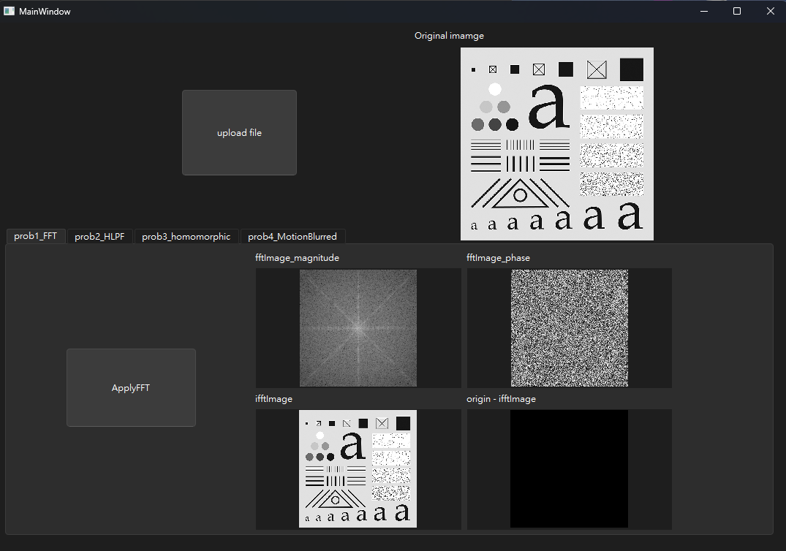
**A:**  
若矩陣想分離為兩個向量的外積，需要滿足矩陣的rank=1。  
而3.45(a),(b)的rank=2，不滿足條件，因此無法分解。  

**(b)** The Roberts cross-gradient kernels shown in Figs. 3.50(b) and (c).  
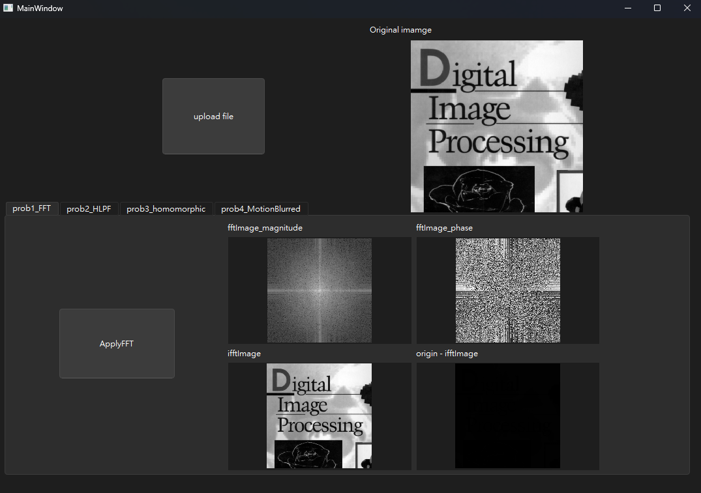
**A:**  
3.50(b),(c)的rank同樣為2，不滿足條件，因此無法分解。  

**(c)** * The Sobel kernels in Figs. 3.50(d) and (e).  
**A:**  
3.50(d):  
$$
\begin{bmatrix}
  -1 & -2 & -1 \\
  0 & 0 & 0 \\
  1 & 2 & 1
\end{bmatrix}
=
\begin{bmatrix}
  -1 \\
  0 \\
  1
\end{bmatrix}
\begin{bmatrix}
  1 & 2 & 1
\end{bmatrix}
$$

3.50(e):  
$$
\begin{bmatrix}
  -1 & 0 & 1 \\
  -2 & 0 & 2 \\
  -1 & 0 & 1
\end{bmatrix}
=
\begin{bmatrix}
  1 \\
  2 \\
  1
\end{bmatrix}
\begin{bmatrix}
  -1 & 0 & 1
\end{bmatrix}
$$

### 【4.3】
**Q:** What is the convolution of two, 1-D impulses:  

**(a)** * $\delta(t)$ and $\delta(t-t_0)$?  
**A:**  
$$
\delta(t) *\delta(t-t_0) 
= \int_{-\infty}^{\infty} \delta(\tau)\delta(t-(\tau-\tau_0)) \, d\tau
=
\delta(t-t_0)
$$

**(b)** $\delta(t-t_0)$ and $\delta(t+t_0)$?  
**A:**  
$$
\delta(t-t_0)*\delta(t+t_0)=\int_{-\infty}^{\infty} \delta(\tau-\tau_0)\delta(t-(\tau+\tau_0)) \, d\tau = \delta(t)
$$

### 【4.51】
**Q:** Find the equivalent frequency-domain filter transfer function for the Laplacian kernel shown in Fig. 3.45(a). Show that your result behaves as a highpass filter transfer function. (Hint: Study the solution to Problem 4.47.)  

**A:** 
1. 找到拉普拉斯核的傅立葉變換
    首先定義laplacian運算子為:
    $$
    \begin{bmatrix}
      0 && -1 && 0 \\
      -1 && 4 && -1 \\
      0 && -1 && 0
    \end{bmatrix}
    =
    \begin{bmatrix}
      h(-1, -1) && h(0, -1) && h(1, -1) \\
      h(-1, 0) && h(0, 0) && h(1, 0) \\
      h(-1, 1) && h(0, 1) && h(1, 1) 
    \end{bmatrix}
    $$
  
   
2. 計算拉普拉斯核的2D (離散時間傅立葉轉換)DTFT  
    雙變數DTFT公式為:  
    $$H(u, v) = \sum_{x=-\infty}^{\infty} \sum_{y=-\infty}^{\infty} h(x, y) e^{-j2\pi(ux + vy)}$$
    帶入拉普拉斯核的值，計算如下:
    $$H(u, v) = \sum_{x=-1}^{1} \sum_{y=-1}^{1} h(x, y) e^{-j2\pi(ux + vy)}$$
    
    - \(h(-1, -1) = 0\)：
    $$0 \cdot e^{-j2\pi(u(-1) + v(-1))} = 0$$

    - \(h(-1, 0) = 1\)：

    $$1 \cdot e^{-j2\pi(u(-1) + v(0))} = e^{j2\pi u}$$

    - \(h(-1, 1) = 0\)：

    $$0 \cdot e^{-j2\pi(u(-1) + v(1))} = 0$$

    - \(h(0, -1) = 1\)：

    $$1 \cdot e^{-j2\pi(u(0) + v(-1))} = e^{j2\pi v}$$

    - \(h(0, 0) = -4\)：

    $$-4 \cdot e^{-j2\pi(u(0) + v(0))} = -4$$

    - \(h(0, 1) = 1\)：

    $$1 \cdot e^{-j2\pi(u(0) + v(1))} = e^{-j2\pi v}$$

    - \(h(1, -1) = 0\)：

    $$0 \cdot e^{-j2\pi(u(1) + v(-1))} = 0$$

    - \(h(1, 0) = 1\)：

    $$1 \cdot e^{-j2\pi(u(1) + v(0))} = e^{-j2\pi u}$$

    - \(h(1, 1) = 0\)：

    $$0 \cdot e^{-j2\pi(u(1) + v(1))} = 0$$

    - 因此最後可知拉普拉斯算子的離散時間傅立葉變換為: 
    $$H(u, v) = 4 - e^{-j2\pi u} - e^{-j2\pi u} - e^{-j2\pi v} - e^{-j2\pi v}$$

    $$=H(u, v) = 4 - 2\cos(2\pi u) - 2\cos(2\pi v)$$

3. 濾波後的結果  
    - 在 DTFT 和 DFT 中， 𝑢 和 𝑣 是相對頻率，範圍在 −0.5 到 0.5 之間。這些頻率是基於取樣率 (sampling rate) 的歸一化頻率，而不是直接的赫茲值。具體可以透過$f=u⋅f_s$(實際頻率=相對頻率*取樣率)換算。並且可以看出取樣頻率至少需要實際頻率的兩倍，才能完整取樣。  
    - 𝑢=0 和 𝑣=0 表示直流分量，也就是影像的均勻部分或整體平均亮度。  
    - 𝑢=0.5 和 𝑣=0.5 表示最高頻率，對應到圖像中變化最快的部分，例如邊緣和細節。 
    - 𝑢=-0.5 和 𝑣=-0.5則對應到頻譜的另一邊，頻率和 0.5 相同，但方向相反。
   1. 低頻時𝑢=0 和 𝑣=0，可以觀察到H(u, v)變為0，相當於把直流/低頻訊號過濾:  
      $$H(u, v) = 4 - 2\cos(2\pi u) - 2\cos(2\pi v)$$
      $$=H(0, 0) = 4 - 2\cos(0) - 2\cos(0) = 4-2-2 = 0$$

   2. 高頻時𝑢=0.5 和 𝑣=0.5，可以觀察到H(u, v)變為8，相當於把高頻訊號增強8倍:  
      $$=H(0.5, 0.5) = 4 - 2\cos(\pi) - 2\cos(\pi) = 4+2+2 = 8$$

 

# Part 2. 
Design a computer program for spatial filtering operations using various types of masks. Test your program with several images and report your results. Discuss the effect of mask size on the processed images and the computation time.  
You should design a mask operation function that is flexible for adjusting mask size and setting coefficients in the mask.  

設計一個電腦程序，用於使用各種類型的掩模進行空間濾波操作。使用多個圖像測試您的程式並報告您的結果。討論掩模尺寸對處理影像和計算時間的影響。  

您應該設計一個靈活的遮罩操作函數，用於調整遮罩尺寸和設定遮罩中的係數。  

## 【算法實現與解釋】
因為要開始進行卷機操作，需要先對影像根據 convolution kernel size，判斷 padding 的大小。其中 padding size 為 kernel size / 2，並且需要對上下左右都進行。  
在程式當中固定使用 zero padding，因此卷積後會發現出現黑色的邊框，可以使用複製padding等其他方式解決此問題。

## 【結果圖片】
<table>
  <tr>
    <th></th> <!-- 空白單元格，對應表頭 -->
    <th>kernel size 3</th>
    <th>kernel size 21</th>
  </tr>
  <tr>
    <td>median</td> <!-- 新增row name -->
    <td>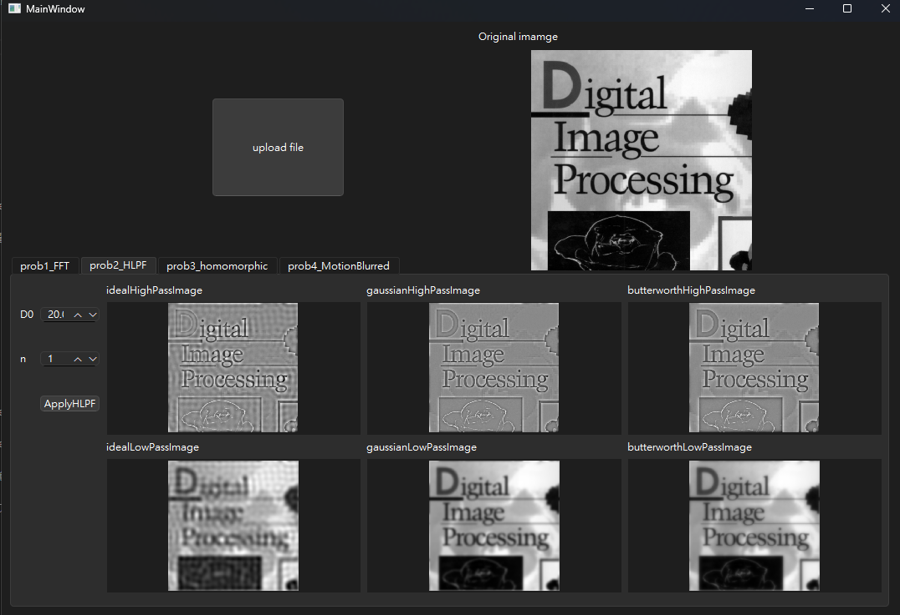</td>
    <td>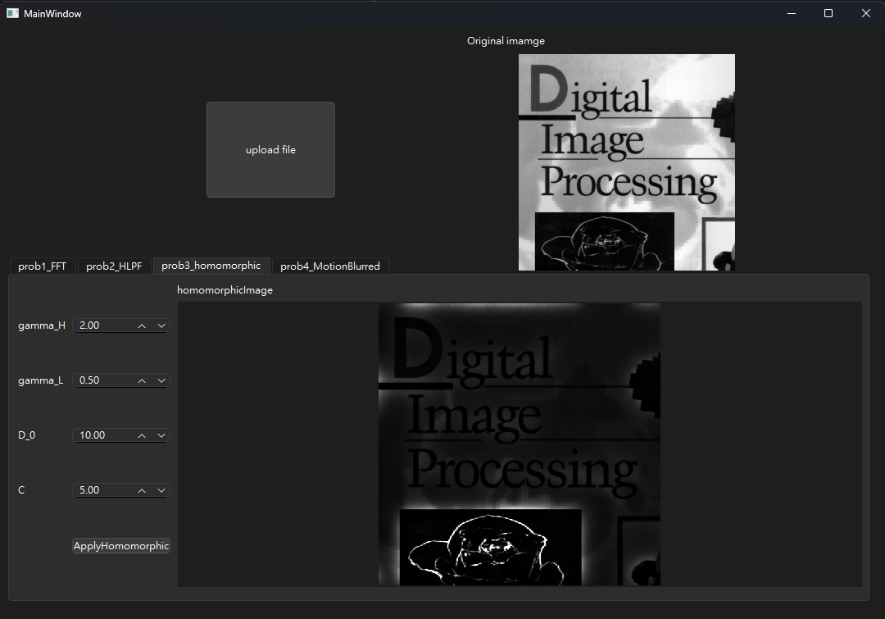</td>
  </tr>
  <tr>
    <td>mean</td> <!-- 新增row name -->
    <td>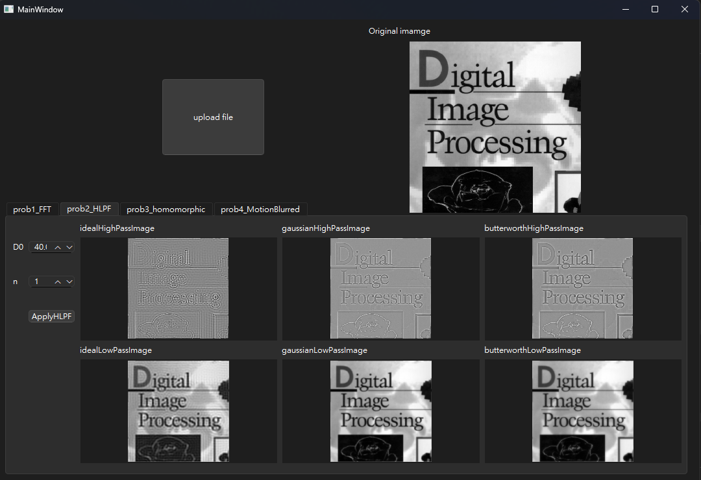</td>
    <td>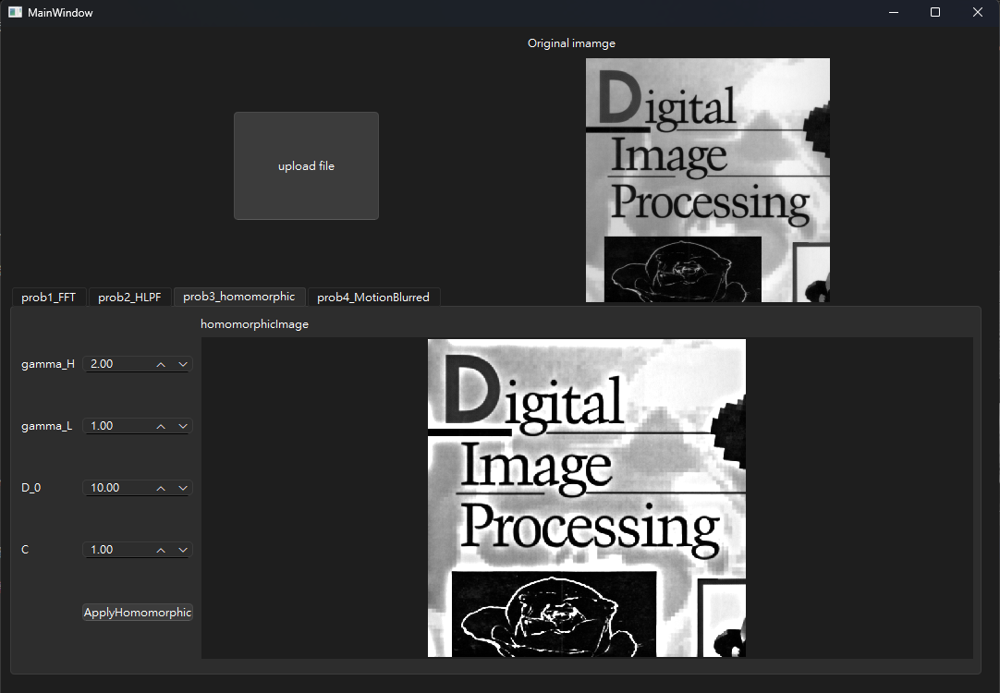</td>
  </tr>
  <tr>
    <td>max</td> <!-- 新增row name -->
    <td>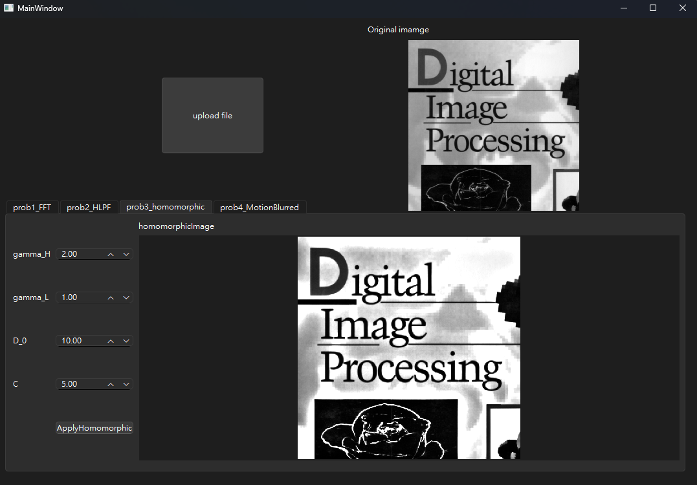</td>
    <td>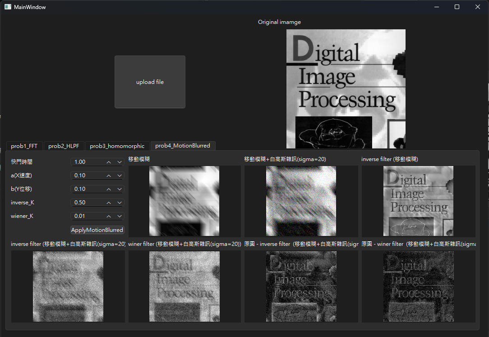</td>
  </tr>
  <tr>
    <td>min</td> <!-- 新增row name -->
    <td>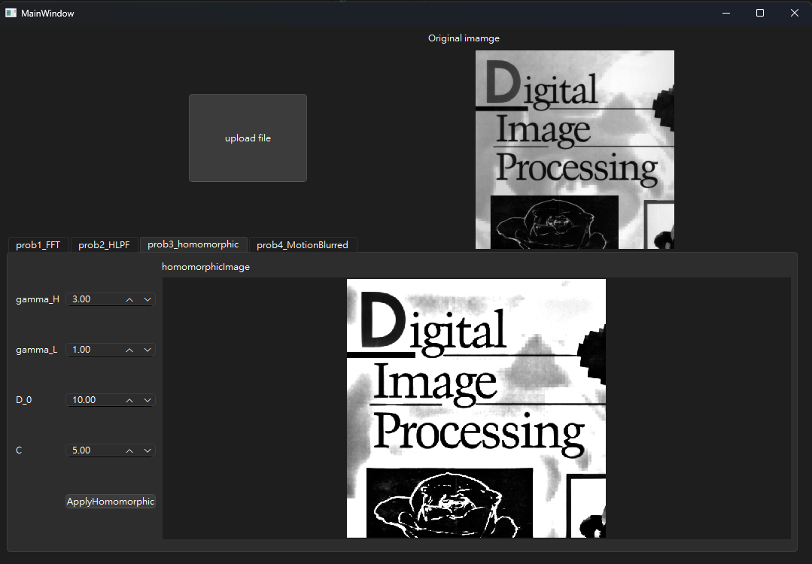</td>
    <td>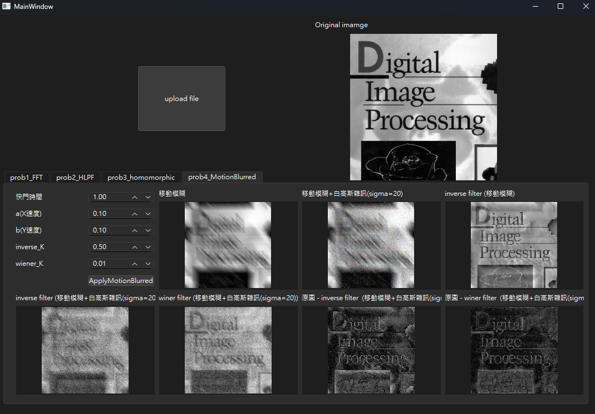</td>
  </tr>
</table>

## 【結果討論】

 

# Part 3. 
The Marr-Hildreth edge detection method operates by convolving the image with the Laplacian of Gaussian operators. Laplacian of Gaussian (LoG) is a second derivative of a Gaussian filter. The
LoG can be broken up into two steps. First, smooth the image with a Gaussian filter, and second, convolve the image with a Laplacian mask. Read the Section 10.2 of our textbook for a detailed theory
and procedure of this edge detection method.  
Implement a computer program for edge detection using the Marr-Hildreth edge detector. Test your program with at least 4 images and compare the results with those processed with the Sobel
operator. Sample images are provided in the NTU COOL course website. To locate the edges of the images processed with the Marr-Hildreth detector, you will need to further process the images with the
zero-crossing detector as described in the textbook.  
Discuss the effect of zero-crossing threshold on the Marr-Hildreth edge detection method.  

Marr-Hildreth 邊緣偵測方法透過將影像與高斯拉普拉斯算子進行卷積來進行操作。高斯拉普拉斯算子 (LoG) 是高斯濾波器的二階導數。 LoG 可分為兩個步驟。首先，使用高斯濾波器平滑影像，然後使用拉普拉斯掩模對影像進行卷積。請閱讀我們教科書的第 10.2 節，以了解這種邊緣偵測方法的詳細理論和過程。  

使用 Marr-Hildreth 邊緣偵測器實作邊緣偵測電腦程式。使用至少 4 個影像測試您的程序，並將結果與使用 Sobel 算子處理的結果進行比較。 NTU COOL 課程網站上提供了範例圖像。要定位使用 Marr-Hildreth 偵測器處理的影像的邊緣，您需要按照教科書中的描述使用過零偵測器進一步處理影像。  
<!--   -->

## 【算法實現與解釋】
- 分別計算水平及垂直方向sobel算子的結果，將兩個方向的結果進行平方和後開根號，即可得到新的強度值。
- LoG（Laplacian of Gaussian）是對Gaussian低通濾波進行二次微分得到。因為做了二次微分以後會出現負的值，因此不能直接保存影像顯示。需要接著使用零交叉偵測二值化後才能顯示。

## 【結果圖片】
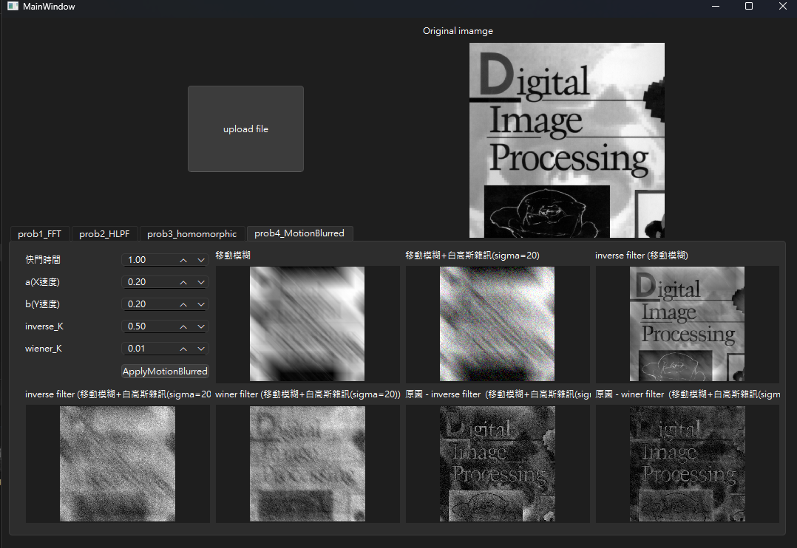

## 【結果討論】
Sobel能不需調參就得到相當好的結果。而 Marr-Hildreth 的結果雖然能過濾掉更多雜訊與更精準的過濾掉非邊緣，但是需要將當精細的調參，並且邊緣也會有些破碎。

### 【Marr-Hildreth 參數設計概念】
1. sigma（高斯模糊的標準差）
  - 概念值範圍：1.0 到 3.0  
  - 通常的設定：  
    - 小細節檢測：sigma = 1.0，適合檢測細小邊緣，但對噪聲也敏感。
    - 平滑噪聲和大結構檢測：sigma = 2.0 至 3.0，能夠有效平滑噪聲，檢測較大的邊緣，通常用於圖像較模糊或噪聲較多的情況。  
2. 高斯核的大小（kernel size）
  - 概念值範圍：通常為 3x3 到 21x21 之間
  - 通常的設定：
    - 小核：3x3、5x5，適合在高分辨率圖像上檢測細微的邊緣。
    - 中等核：9x9、11x11，適合在大部分情況下平衡邊緣細節和噪聲抑制。
    - 大核：15x15、21x21，適合噪聲較大的圖像，抑制小噪聲並突出較大區域的邊緣。
3. 零交叉閾值（threshold）
  - 概念值範圍：0.1 到 1.0（取決於邊緣強度範圍）
  - 通常的設定：
    - 低閾值：threshold = 0.1，檢測到更多的邊緣，適合細緻的邊緣檢測。
    - 中等閾值：threshold = 0.3 到 0.5，平衡邊緣細節和噪聲抑制。
    - 高閾值：threshold = 0.7 到 1.0，適合忽略較弱的邊緣，強調主要結構。

 

# Part 4. 
Implement a computer program following the local enhancement method described in Example 3.10 of the textbook. You need to complete the following task with your program:
1. Reproduce the enhanced image of Figure 3.27b using the original image provided (image 4-1.jpg).  
2. Process the original images (image 4-1.jpg, image 4-2.jpg) with the local enhancement method and compare the results with the processed images using histogram equalization method.  
3. Discuss the effect of neighborhood region size, Sxy, on the local enhancement image processing results.  

依照教科書例3.10所述的局部增強方法實作電腦程式。您需要使用您的程式完成以下任務：

1. 使用提供的原始影像（影像 4-1.jpg）再現圖 3.27b 的增強影像。  
2. 使用局部增強方法對原始影像（影像4-1.jpg、影像4-2.jpg）進行處理，並使用直方圖均衡方法將結果與處理後的影像進行比較。  
3. 討論鄰域區域大小 S 對局部增強影像處理結果的影響。  

## 【算法實現與解釋】
根據以下算式，當局部影像強度和局部影像對比度，都在全局的某個範圍中(k0, k1設定強度範圍；k2, k3設定對比範圍)，才套用影像增強(原強度乘C)。否則不做任何增強或衰減操作。
$$
g(x, y) = \begin{cases} 
C f(x, y) & \text{if } k_0 m_G \leq m_{s_{xy}} \leq k_1 m_G \text{ AND } k_2 \sigma_G \leq \sigma_{s_{xy}} \leq k_3 \sigma_G \\ 
f(x, y) & \text{otherwise} 
\end{cases}
$$

## 【結果圖片】

## 【結果討論】

- 較小的kernel size：增強效果只會依賴非常鄰近的像素，這樣可能會導致更細微的區域增強，但可能會增加噪聲敏感度。  
- 較大的kernel size：增強效果會考慮更大範圍內的鄰域像素，能夠更有效地去除噪聲，並能平滑整體效果，但可能會失去一些局部細節。