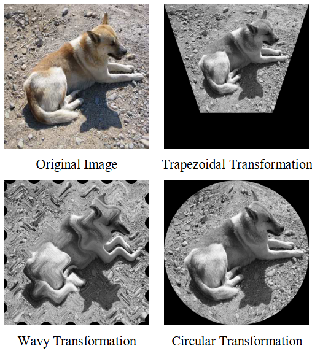
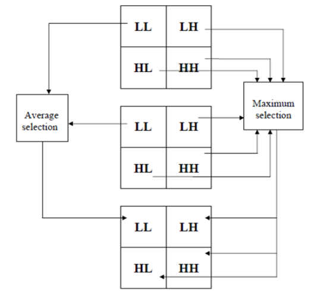
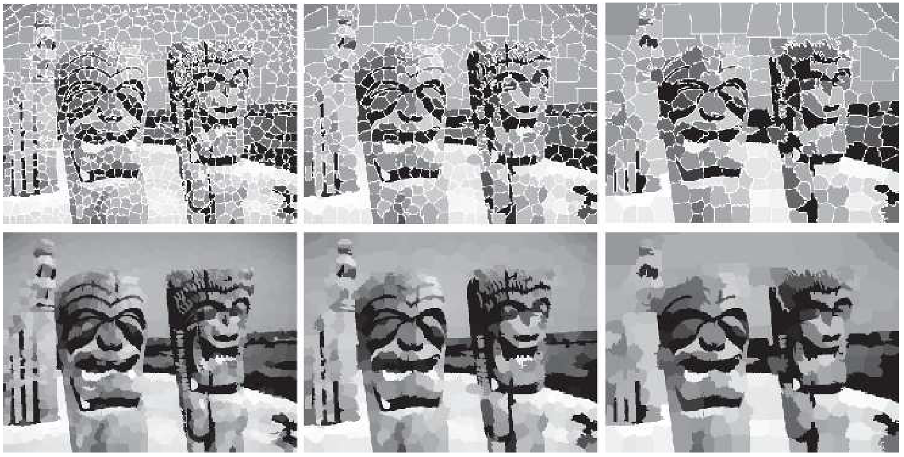
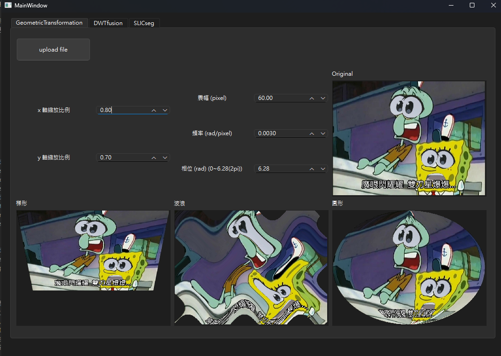
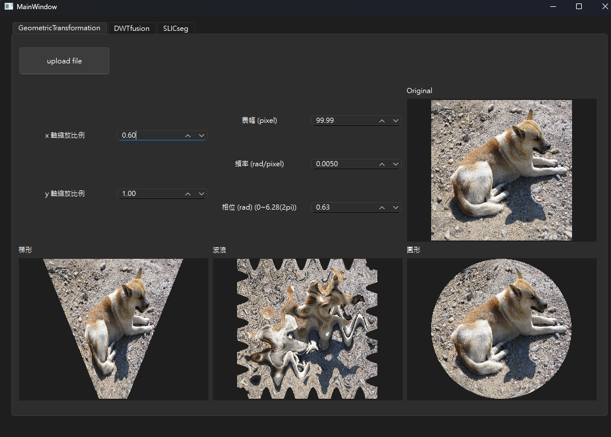

<!-- title: 影處HW6 -->
---
Title: 影處HW6  
Student ID: R12631070  
Name: 林育新  
---

# Part 1. 
Design a computer program for geometric transformation of an image. Try to find the optimal geometric transformation to obtain the warped images shown below. Describe your approach as clearly as possible and show the resulting images. You may also challenge yourself by designing an interactive interface for more flexible geometric transformation.

設計一個用於圖像幾何變換的電腦程式。嘗試找到最佳幾何變換以獲得如下所示的扭曲影像。盡可能清楚地描述您的方法並顯示結果圖像。您還可以透過設計互動式介面來挑戰自己，以實現更靈活的幾何變換。

## 【結果圖片】

|  |  |
| :----------------------------------: | :------------------------------------: |

|  |  |
| :------------------------------------: | :------------------------------------: |

|  |  |
| :------------------------------------: | :-------------------------------------: |
 

 

# Part 2. 
The algorithm of image fusion using DWT is described in the following steps:

1. The size of images to be fused needs to be the same size and the resolution needs to be of power of two.
2. The two dimensional Discrete Wavelet Transform (DWT) should be applied to the resized images.
3. Fusion rule: The most used image fusion rule using wavelet transform is maximum selection, by comparing the DWT coefficients of the two (or more) images and select the maximum. While the lowpass subband is an approximation of the input image, the three detail subbands convey information about the detail parts in horizontal, vertical and diagonal directions. Different merging procedures will be applied to approximation and detail subbands. Lowpass subband will be merged using simple averaging operations since they both contain approximations of the source images, and the maximum selection rule is applied to detail subbands, as shown in the following figure.
4. After selecting the fused low frequency and high frequency bands, fused image is reconstructed using the inverse DWT from on the subbands determined in step 3.

Implement an image fusion program applying the DWT method as described above.
1. Test your program with the image sets provided in this homework and image sets you wish to test.
2. Quantitatively and qualitatively compare and discuss the effect of the image fusion results using different scales of decomposition.

使用DWT進行影像融合的演算法描述如下：
1. 融合影像的大小需要相同，解析度需要為2的冪。
2. 二維離散小波轉換（DWT）應該應用於調整大小的影像。
3. 融合規則：使用小波轉換最常用的影像融合規則是最大值選擇，透過比較兩個（或多個）影像的DWT係數並選擇最大值。雖然低通子帶是輸入影像的近似，但三個細節子帶傳達有關水平、垂直和對角線方向的細節部分的訊息。不同的合併過程將應用於近似子帶和細節子帶。低通子帶將使用簡單的平均操作進行合併，因為它們都包含來源影像的近似值，並且最大選擇規則應用於細節子帶，如下圖所示。
4. 選擇融合的低頻和高頻段後，使用步驟 3 中確定的子帶的逆 DWT 重建融合影像。

如上所述，應用 DWT 方法實現影像融合程序。
1. 使用本作業中提供的圖像集和您想要測試的圖像集來測試您的程式。
2. 定量和定性地比較和討論使用不同尺度分解的影像融合結果的效果。

## 【結果圖片】

 

# Part 3. 
You are given a digital image and your task is to perform regional segmentation using a superpixel method. Superpixels are compact, perceptually meaningful regions that can be used as an intermediate step for more advanced image processing tasks. Your goal is to group similar pixels together to form these superpixels and segment the image into regions.

1. Choose an image of your preference (or use the accompanied sample image).
2. Implement a superpixel algorithm using Simple Linear Iterative Clustering (SLIC) described in Section 10.5 of the textbook.
3. Tune the algorithm's parameters (e.g., number of superpixels) for the best segmentation results. You may need to experiment with different parameter settings.
4. Carry out superpixel segmentation on the chosen image and display the resulting superpixel regions. Ensure that you superimpose these regions onto the original image for visual representation, akin to the illustration in Figure 10.51 of the textbook.
5. Provide a written explanation of the superpixel algorithm you used, the chosen parameters, and the results of your segmentation. Discuss the strengths and weaknesses of your method.
6. Compare and contrast your superpixel-based segmentation with a traditional method, such as K-means clustering, in terms of computational efficiency and quality of segmentation.

給你一張數位影像，你的任務是使用超像素方法執行區域分割。超像素是緊湊的、具有感知意義的區域，可用作更高級影像處理任務的中間步驟。您的目標是將相似的像素組合在一起以形成這些超像素並將影像分割成區域。

1. 選擇您喜歡的圖像（或使用隨附的範例圖像）。
2. 使用教科書第 10.5 節中所述的簡單線性迭代聚類 (SLIC) 實作超像素演算法。
3. 調整演算法的參數（例如，超像素的數量）以獲得最佳分割結果。您可能需要嘗試不同的參數設定。
4. 對所選影像進行超像素分割並顯示所得的超像素區域。確保將這些區域疊加到原始圖像上以進行視覺表示，類似於教科書圖 10.51 中的插圖。
5. 提供您使用的超像素演算法、所選參數以及分割結果的書面說明。討論你的方法的優點和缺點。
6. 在計算效率和分割品質方面將基於超像素的分割與傳統方法（例如 K 均值聚類）進行比較和對比。

<!--   -->

## 【結果圖片】

## 【結果討論】

